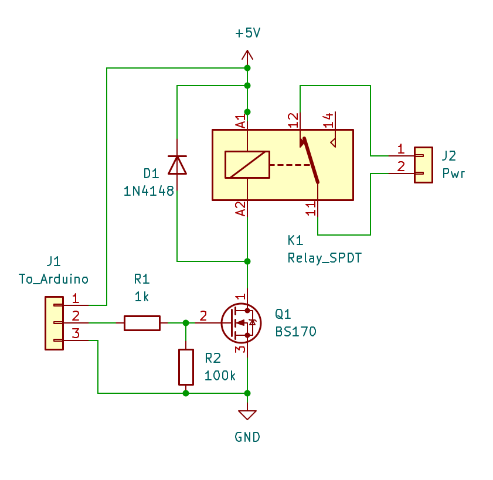

# Smart Watchdog on Arduino

A smart watchdog capable of monitoring our automated system and restarting it when it freezes.

When building unattended automated systems, especially when installed in remote locations that are hard to reach, it is essential to provide a reset method that can bring the device back online without physical intervention. The increasing complexity of modern equipment, now full of computers in various forms, has brought many kinds of issues whose common cure is the legendary universal IT solution: power it off and on again.

For this reason, it is very useful to have a smart guardian that can supervise the correct operation of the system and physically remove and restore power whenever an anomaly is detected.

In this project, we build a watchdog, that is, an external device that monitors the system's vital signs and, in case of anomalies, power-cycles everything.

## General Description

This device is designed to monitor any computer with a USB port, including Raspberry Pi and other single-board computers with USB connectivity. It is built around an Arduino Nano based on ATmega328P, connected via USB cable to the monitored computer. Through an output pin, it controls a relay that, when energized, disconnects power to the protected system.

The computer connected over USB sees the Arduino as a serial port at 115200 bps and can communicate with the watchdog. The computer's task is to continuously stimulate this serial port by periodically sending the text `ALIVE`. If Arduino does not receive this string for longer than a configured timeout, it assumes the computer is frozen and performs a full power cycle.

Of course, a computer freeze is not the only case to monitor. In particular, failures in connected peripherals may also require a power cycle performed by Arduino. For example, the most frequent case in my installations is LTE connectivity lockup, which makes the device unreachable and is solved by power-cycling the modem.

In this implementation, the computer continuously checks the health of its own peripherals and, in case of anomalies, can instruct the watchdog through the USB serial interface to reboot the system immediately. For example, connectivity can be verified by pinging IP addresses that are expected to always respond, such as DNS servers 1.1.1.1 and 8.8.8.8: if all pings fail, connectivity is no longer working.

## Power Supply

In this project setup, it is important to ensure Arduino has an independent power source and is not powered by the same devices it is meant to shut down. In particular, it should not receive power from USB, but from the VIN pin when using unregulated voltage above 5V, or directly from the +5V pin when a regulated 5V source is available.

If voltage levels are compatible with Arduino, it can be powered directly from the main supply upstream of the relay used to shut down the other devices. If it is not possible or practical to provide separate power, Arduino can be kept alive with a supercapacitor long enough to perform shutdown and restart. This means energizing the relay for a few seconds, enough time for all peripherals to actually turn off.

The energy required for this operation must include Arduino consumption (about 20 mA) and relay consumption (for a small 5V relay, typically 50-100 mA), multiplied by the time required for a full shutdown/restart cycle.

In any case, Arduino USB power is protected by a diode, so there is no risk that Arduino unintentionally keeps powered the device it is trying to switch off through the USB port.

## Power-Cut Circuit

The power-cut circuit is centered on a 5V SPDT relay. With the relay de-energized, the contact conducts and everything is powered. When the relay is energized, the contact disconnects power and the connected devices shut down. This choice also ensures that, in case of circuit failure, the rest of the system remains powered with the relay at rest, sacrificing only watchdog-controlled shutdown capability.




The relay receives 5V on pin A1, while the ground path from pin A2 is controlled by a BS170, an N-channel logic-level MOSFET with a low enough gate threshold to be driven by a 5V Arduino output.

Using any available output pin, when Arduino wants to switch off the devices, it provides 5V through resistor R1. This series resistor is a precaution to limit current from the Arduino pin. Driving a BS170 gate has an initial current spike that can reach 10-15 mA and then drops close to zero because the gate behaves like a small capacitor. Current limiting is not strictly required, but it helps protect the microcontroller in case of faults or accidental contacts during testing.

The 100 kOhm resistor R2 acts as a pull-down, keeping the MOSFET gate at ground and ensuring it stays off unless intentionally driven by the microcontroller. Although pull-down is already effectively provided by the microcontroller, an external resistor is useful if the MCU pin is temporarily disconnected or left floating (neither tied to +5V nor ground).

Finally, diode D1 suppresses reverse voltage spikes generated across the relay coil when it is energized or de-energized due to magnetic field changes.

The circuit is very simple, can be assembled on perfboard, and shares the same 5V supply as Arduino.

## Intervention Timings

Watchdog intervention is very useful when a system freezes, but it must not itself become a source of malfunction. Beyond possible faults and bugs, the operating logic must be designed so that normal behavior is not mistaken for a freeze.

For this reason, watchdog software uses the following timing parameters:

- **OFF TIME**: how long the relay should remain in the off state before being turned back on. This must be calibrated so all devices fully discharge any smoothing capacitors and truly power down. Default: 4 seconds.
- **BOOT TIME**: time to wait after reboot before deciding the system failed to start and must be rebooted again. This must include OS boot time and exceptional cases, such as updates or automatic disk checks, that can delay full startup. Default: 6 hours.
- **ALIVE TIME**: timeout after receiving an `ALIVE` message before forcing reboot. If an `ALIVE` has already been received, the system is considered running, so delayed or missing `ALIVE` messages indicate a system freeze or at least a failure of the software sending them. Default: 30 minutes.

## The Software

The core of the implementation is a simple Arduino project named `SmartWatchDog.ino`, which contains the watchdog logic. The software is available in this GitHub project:

https://github.com/DavideAchilli/SmartWatchdog

The project uses pin `A5` as relay output (see macro `RELAY_PIN`) because it is close to power pins and convenient for wiring, but any other output pin can be used by changing `RELAY_PIN`.

The program responds to commands received on the serial interface configured as 115200 bps, 8N1, as shown in the command table.

The same commands are also used to set `boot`, `alive`, and `off` timings, which are immediately saved to EEPROM and preserved across power cycles. The software defines minimum and maximum bounds for each timing so invalid entries (for example, too-short intervals) cannot cause system lockups due to continuous watchdog-induced reboots.

## Command Table

Table of commands accepted by the watchdog on Arduino.

## Watchdog for the Watchdog

Naturally, the watchdog itself is a small computer and may also freeze, so it should have its own watchdog. ATmega328P microcontrollers include a watchdog function: independent hardware circuitry from the CPU that can reset the MCU if it does not receive a timely heartbeat proving software is still alive.

In the proposed software, the internal watchdog timeout is set to 8 seconds and is re-armed by the main program loop.

**IMPORTANT**: some Arduino bootloader versions (the small program automatically run at startup before your application) are not compatible with the ATmega watchdog. In those versions, reset occurs but the program does not restart unless the board is physically reset.

Before production deployment, verify internal watchdog behavior with command `NOWD`. With this command, software stops calling `wdt_reset()`, which re-arms the watchdog timer; after about 8 seconds, the board should reset itself by internal watchdog action. If it resumes operation within a couple of seconds, all good. If it remains stuck and requires physical reset, the bootloader is incompatible.

In that case, there are two options:

1. Install an updated bootloader. This can be done from the Arduino IDE using a second Arduino as programmer and is well documented online: load the programmer sketch from examples onto the programmer board, then connect the board to be updated through the required pins.
2. If update is not performed for any reason, disable internal watchdog usage by setting macro `USE_ATMEGA32_WATCHDOG` to `0` at the beginning of the sketch.

## Computer-Side Code

Watchdog operation is a synergy between controller and controlled system: Arduino on one side and the PC/Raspberry on the other. The controlled system must run an application that periodically reassures the watchdog by sending `ALIVE`, so unnecessary reboots are not triggered. The same software should also monitor strategic peripherals (for example connectivity) and explicitly request reboot by sending command `REBOOT` when anomalies are detected.

It is strategically important that a single program cyclically sends `ALIVE` and checks strategic resources. In this way, if that program freezes, strategic resource checks stop, but `ALIVE` sending also stops and eventually triggers a beneficial reboot after the configured timeout.

The previously mentioned Git archive contains a Python program called `WatchDogHostClient.py` that checks basic Raspberry vital parameters, including connectivity, sends `ALIVE` messages to the watchdog, and logs events.

The proposed script not only sends `ALIVE`, but also verifies connectivity via `ping` and logs values such as CPU temperature, useful for long-term stability checks.

## Manual Commands

One peculiarity of Arduino bootloader behavior is that every time the serial port is opened or closed, the board resets because serial DTR or RTS lines are connected to reset pin. This is intentional and required so bootloader restarts at each reconnection, allowing upload of a new sketch.

Restarting the watchdog has no major side effects, except timing logic returns to reboot mode and counters are reset.

To issue manual commands without disturbing the system with reboots, the Python script, when running, provides a local interface accessible directly from Linux shell using telnet:

```text
telnet 127.0.0.1 5001
```

Once connected, you can issue all watchdog commands such as `STATUS` to view current settings. Through this interface you can change timings stored in Arduino and perform any other operation without causing Arduino reboot.

## Autostart

It is obvious but worth emphasizing: the monitoring script must start automatically on the host computer at every reboot. Otherwise, after the first restart there is no program sending `ALIVE`, and watchdog would keep rebooting forever.

For automatic startup on Linux-based systems (for example Raspberry), the most common and recommended approach is a `systemd` service, for which countless examples exist online. In any case, any method suitable for your operating system and skill set is fine, as long as the control script starts reliably.

## Script Parameters

The parameters for script `WatchDogHostClient.py` are as follows.

| Parameter | Description |
|-----------|-------------|
| -h, --help | Show the help text with available commands |
| --serial port | Serial port to which the watchdog Arduino is connected; if not specified, defaults to `/dev/ttyUSB0`. |
| --alive seconds | Interval between `ALIVE` messages in seconds; if not specified, defaults to 30 seconds. |
| --log filename | Full path of the log file to generate; if not specified, no log file is created. Enabling the log is recommended to track reboot history and their causes. |
| --cli_host ip-address | Listening address for the telnet command server; default: `127.0.0.1` |
| --cli_port port | Port for the telnet command server; default: `5001` |
| --sys_poll seconds | Polling interval for system data such as temperature and undervoltage; if not specified, system data is not collected |
| --ping a.b.c.d ... | IP addresses to ping, space-separated. Example: `--ping 1.1.1.1 8.8.8.8`. If not specified, network connectivity is not monitored |
| --ping_wait seconds | Pause in seconds between consecutive pings; typically 60 s |
| --max_net_unreach seconds | Maximum time in seconds that consecutive ping failures are tolerated before declaring a serious network disconnection. It is advisable to wait a few minutes when pings fail, as these are usually temporary outages that resolve on their own. Default: 600 s (10 minutes). |

